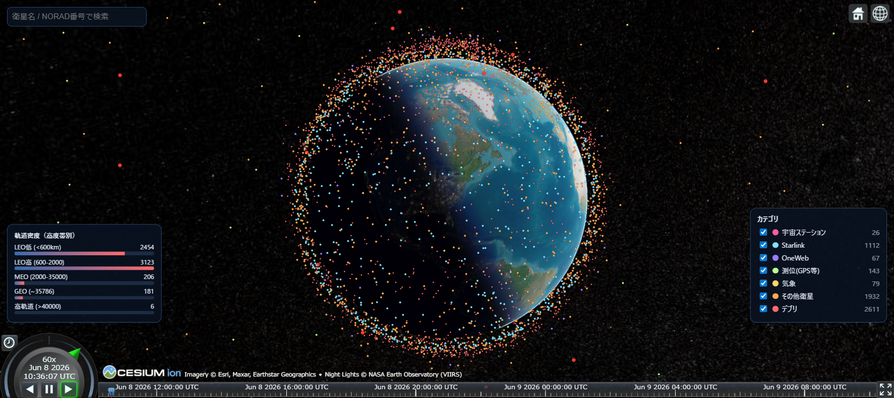

# orbit-tracker

地球周回中の人工衛星・宇宙ステーション・デブリを 3D 地球儀の上でリアルタイムに俯瞰できる無料の Web アプリ。



> **Live demo: https://orbit-tracker.pages.dev/**
>
> 特定の衛星を共有するには `?sat=<NORAD番号>` を付けます（例: [ISS](https://orbit-tracker.pages.dev/?sat=25544)）。

---

## What it does

- 約 6,000 件の人工物（稼働中衛星・宇宙ステーション・Starlink・OneWeb・測位衛星・気象衛星・主要デブリ群）を NASA の衛星画像で覆われた 3D 地球儀上にプロット
- 昼側は NASA Blue Marble、夜側は NASA VIIRS City Lights の街明かり
- 物体をクリックすると詳細パネル（高度・速度・軌道周期・軌道傾斜角・遠地点/近地点・国・打ち上げ日）と 1 周ぶんの軌道線
- 名前 / NORAD 番号で検索し、カメラを寄せてロックオン追従
- カテゴリ別タブで衛星種別の表示 / 非表示を切替（色分け済み）
- 時間コントロール（再生・早送り・過去/未来へスクラブ）
- 高度帯別の物体密度バー
- 再突入間近の物体は赤くハイライト

---

## How it works

- 描画: [CesiumJS](https://cesium.com/platform/cesiumjs/) — Ion トークン無しで動作
- 衛星画像: [NASA Earth Observatory (GIBS)](https://earthdata.nasa.gov/eosdis/science-system-description/eosdis-components/gibs) (Blue Marble + VIIRS)
- 軌道計算: [satellite.js (SGP4)](https://github.com/shashwatak/satellite-js) を Web Worker で実行
- TLE データ: [CelesTrak](https://celestrak.org) (GP/active と主要デブリ群)
- ビルド: Vite + TypeScript

TLE データは GitHub Actions の cron が 4 時間ごとに CelesTrak から取得し、ビルドに同梱されています。クライアントはデータ API を直接叩かず CDN から静的ファイルを読むので、人気が出てもデータソースが詰まりません。

---

## Run locally

```bash
git clone https://github.com/tokiyoshi0410-wq/orbit-tracker.git
cd orbit-tracker
npm install
npm run dev   # http://localhost:5173
```

```bash
npm test       # vitest による単体テスト
npm run build  # 本番ビルドを dist/ に出力
```

Node.js 22 以降、モダンブラウザ（WebGL2 必須）を想定しています。

---

## Data sources & attribution

| データ | 提供元 | ライセンス |
| --- | --- | --- |
| 軌道要素 (TLE / GP) | [CelesTrak](https://celestrak.org) | CelesTrak の利用規約に従う |
| 昼側衛星画像 | [NASA Blue Marble Next Generation](https://earthobservatory.nasa.gov/features/BlueMarble) | Public Domain |
| 夜側街明かり | [NASA VIIRS City Lights](https://earthobservatory.nasa.gov/features/NightLights) | Public Domain |
| 3D 描画 | [CesiumJS](https://github.com/CesiumGS/cesium) | Apache 2.0 |
| 軌道計算 | [satellite.js](https://github.com/shashwatak/satellite-js) | MIT |

このアプリそのものは MIT ライセンスで配布しています（`LICENSE` を参照）。

---

## Contributing

Issue や Pull Request は歓迎します。新機能の前にまず Issue で議論してもらえると進めやすいです。
